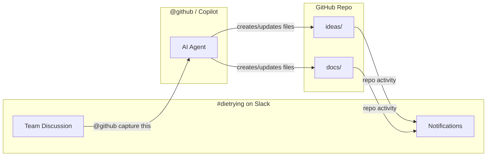

# dietrying

A collaborative project exploring how AI is changing things.

## Team

| Name | Role | Status |
|------|------|--------|
| Erik Heidt | Founder | Active |
| Ryan Niemes | Member | Active |
| Ross | Member | Active |
| Neil | Member | Active |

## Communication

- **Slack**: `#dietrying` channel (primary)
- **GitHub**: This repo (for capturing ideas and documents)
- **History**: Started via Signal chat - introductions and early ideation

## How We Work

We use AI agents (GitHub Copilot in Slack) to handle the technical stuff. No git knowledge required.

**The flow:**
1. **Discuss** ideas in Slack
2. **Capture** by asking `@github` to save to the repo
3. **Everyone gets notified** automatically when the repo updates

## What's Here

| Folder | Purpose |
|--------|---------|
| `ideas/` | Rough thoughts, brainstorms, early explorations |
| `docs/` | More polished or structured documents |

## Getting Started

1. Join `#dietrying` on Slack
2. Start discussing
3. When something's worth keeping, ask `@github` to capture it

See [CONTRIBUTING.md](CONTRIBUTING.md) for more details.
